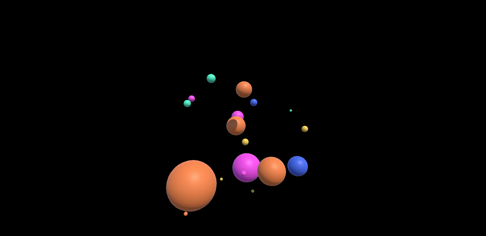
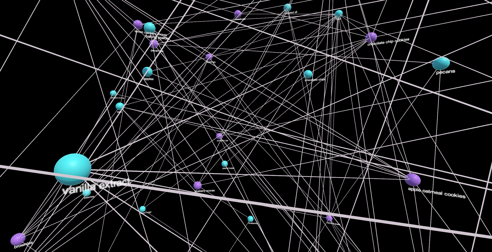

# ImmersiveAnalytics_Project1_MixedRealityVersion
This project displays to 3D Virtual Reality visualizations for ingredients I frequently use in my baking recipes. It requires Unity 2017.2.1p2 to run. It can be run using the play button in Unity, but to be viewed in virtual reality it requires using the Microsoft Mixed Reality head mounted display and the Microsoft Mixed Reality Toolkit in Unity. This project was done for CMPM 290A Immersive Analytics (Graduate Level) at UCSC in Fall 2018. 

Data is stored in an xml file called bakingdata.xml which is inside Assets/Data. 

## Prerequisites

The application requires Unitty 2017.2.1p2 and the Microsoft Mixed Reality Toolkit. It can be run on either OSX for Windows. However, for use with the Microsoft Mixed Reality head mounted display, the system requires the Windows operating system. The virtual reality display will not work on a computer running OSX. 

## Frequency Visualization
Frequency.unity is a visualization that displays the frequency of my ingredient types (e.g dry ingredients, fruit) across all my baking recipes. Each ingredient (e.g flour, lemons) is displayed as sphere, and the color of the sphere corresponds to the type of the ingredient. The size of each sphere corresponds to how often that particular ingredient is used in my recipes, where the bigger the sphere, the most often that ingredient is used. Spheres location placement is randomized.

Dry Ingredients (e.g. flour): orange
Wet ingredients (e.g. milk): pink 
Sweetners (e.g. sugar): blue 
Add-ins (e.g. chocolate chips):green 
Rruits (e.g. blueberries): yellow 

## Node-Link Visualization
Node-Link.unity is a visualization that displays the relationships between ingredients and baking recipes they are used in with a set of node-edge connections. Ingredients are displayed with blue spheres and recipes are displayed with purple spheres. There are also labels under each sphere denoting what ingredient or recipe that sphere corresponds to, and spheres location placement is randomized.

## Instructions
1. Download the project folders into the required version of Unity. 
2. Open the Assets/Scenes folder. There are two scenes in this project Frequency.unity and Node-Link.unity, each corresponding to a different visualization using the same data. Double click on the desired project and press the play button to run either with or without the virtual reality headset. 

